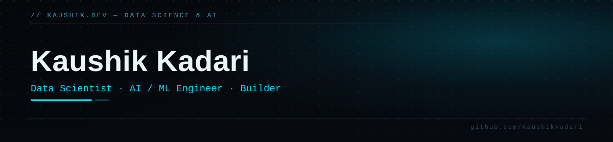

  

  

&nbsp;
&nbsp;
&nbsp;

 

### About

I'm a Data Scientist building applied machine learning systems — most recently pricing and decisioning pipelines that run on Azure, not just in a notebook. My day-to-day sits at the intersection of modeling, data engineering, and shipping things that hold up in production.

- Working primarily in **Python**, inside **Jupyter**, on ML pipelines that touch clustering, GPT-based generation, and cloud data infrastructure
- Comfortable across the stack from **Flask/Django** services to **Azure** (OpenAI, Cosmos DB, Blob Storage, AI Search, ADLS)
- Currently sharpening: `TODO — one line on what you're learning right now`
- Outside of work: editing, writing, and an unreasonable amount of meme-making

 

### Stack

<table>
<tr>
<td valign="top" width="20%"><b>Languages</b></td>
<td valign="top" width="80%">

</td>
</tr>
<tr>
<td valign="top"><b>ML / Data</b></td>
<td valign="top">

</td>
</tr>
<tr>
<td valign="top"><b>Backend</b></td>
<td valign="top">

</td>
</tr>
<tr>
<td valign="top"><b>Cloud</b></td>
<td valign="top">

</td>
</tr>
<tr>
<td valign="top"><b>Tools</b></td>
<td valign="top">

</td>
</tr>
</table>

 

### Activity

<picture>
  <source media="(prefers-color-scheme: dark)" srcset="https://raw.githubusercontent.com/Kaushikkadari/Kaushikkadari/output/github-contribution-grid-snake-dark.svg"/>
  
</picture>

 

### Projects

<table>
<tr>
<td width="50%" valign="top">

**[Cardiovascular Disease Detection](https://github.com/Kaushikkadari/Cardiovascular-Disease-Detection)**
Flask + TensorFlow web app using a CNN-LSTM model to classify cardiovascular disease from ECG signal data.
`Flask` `TensorFlow` `CNN-LSTM`

</td>
<td width="50%" valign="top">

**`TODO: Project name`**
`TODO: one-line description`
`TODO: tags` · [repo →](TODO-url)

</td>
</tr>
</table>

 

### Beyond the code

Editing · Writing · Memes — proof there's a person behind the commits, not just a pipeline.

 

Kaushik Kadari · <a href="https://github.com/Kaushikkadari">GitHub</a> · <a href="https://www.linkedin.com/in/kadarikaushik">LinkedIn</a> · <a href="mailto:kadarikaushik078@gmail.com">Email</a>

