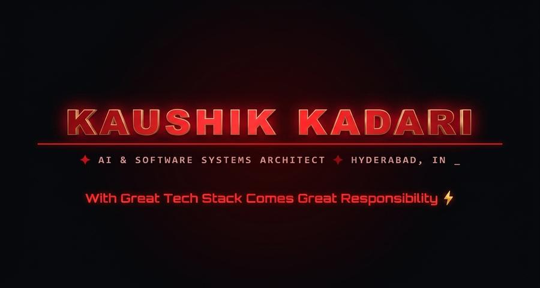
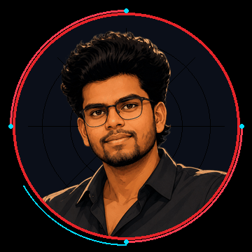
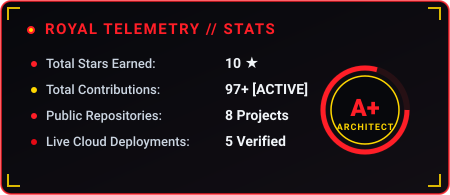
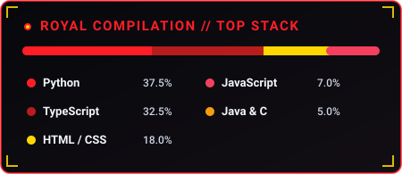

<div align="center">

  <!-- 🕸️ CINEMATIC SPIDER-VERSE HERO BANNER -->
  <a href="https://github.com/Kaushikkadari">
    
  </a>

  <br/><br/>

  <!-- 🕷️ PROMINENT HERO TRIO: MILES MORALES + ANIMATED AVATAR + SPIDER-MAN ACTION -->
  <table border="0">
    <tr>
      <td align="center" valign="middle" width="30%">
        
        <br/>
        <sub><b>🕸️ INTO THE SPIDER-VERSE</b></sub>
      </td>
      <td align="center" valign="middle" width="40%">
        <a href="https://github.com/Kaushikkadari">
          
        </a>
        <br/>
        <b>KADARI KAUSHIK</b>
        <br/>
        <sub>🕷️ Friendly Neighborhood Engineer</sub>
      </td>
      <td align="center" valign="middle" width="30%">
        
        <br/>
        <sub><b>⚡ SPIDER-ARMOR ONLINE</b></sub>
      </td>
    </tr>
  </table>

  <br/>

  <!-- ⚡ DYNAMIC ANIMATED TYPING BANNER -->
  <a href="https://github.com/Kaushikkadari">
    
  </a>

  <br/><br/>

  <!-- 🛡️ HIGH-TECH HUD STATUS BADGES -->
  <p align="center">
    
    &nbsp;
    
    &nbsp;
    
    &nbsp;
    <a href="https://www.linkedin.com/in/kadarikaushik/">
      
    </a>
  </p>

</div>


## 🕷️ / IDENTITY MATRIX (ABOUT ME)

<table>
  <tr>
    <td valign="top">
      <h3>Hey there, True Believer! 👋 I'm <b>Kadari Kaushik</b></h3>
      <p>
        I'm a <b>Computer Science & Engineering (AI & ML)</b> graduate and full-stack software engineer based in <b>Hyderabad, India</b>. Just like Peter Parker swinging through NYC skyscrapers, I traverse the multiverse of <b>Artificial Intelligence</b>, <b>Deep Learning</b>, and <b>Scalable Web Architectures</b>.
      </p>
      <p>
        My focus bridges research and high-reliability production: from training <b>hybrid CNN-LSTM neural nets</b> that detect heart abnormalities from raw ECG signals, to architecting multi-role enterprise web engines with <b>Django</b> and <b>TypeScript</b>.
      </p>
      <ul>
        <li>🎓 <b>Education:</b> B.Tech in CSE (Artificial Intelligence & Machine Learning), Class of 2025.</li>
        <li>🧠 <b>Core Discipline:</b> Computer Vision, Time-Series Deep Learning, and Signal Processing.</li>
        <li>🌐 <b>Full-Stack Craft:</b> Robust backend APIs, Role-Based Access Control (RBAC), and responsive modern frontends.</li>
        <li>⚡ <b>Spider-Sense Fact:</b> <i>"My Spider-Sense tingles whenever code doesn't pass unit tests on the first push!"</i> 🕸️</li>
      </ul>
    </td>
  </tr>
</table>

<br/>

<!-- 🖥️ PETER PARKER PROTOCOL HUD -->
<div align="center">

```text
╔═════════════════════════════════════════════════════════════════════════════════════════════════════╗
║  🕷️ PETER_PARKER_PROTOCOL // KAUSHIK_KADARI_SYSTEMS_v2.0                                           ║
╠═════════════════════════════════════════════════════════════════════════════════════════════════════╣
║  $ identity.whoami()       ➜ "Kadari Kaushik | Software & AI/ML Engineer"                           ║
║  $ location.current()      ➜ "Hyderabad, India [17.3850° N, 78.4867° E]"                            ║
║  $ spider_sense.status()   ➜ "ACTIVE // 0 Unhandled Exceptions in Production"                       ║
║  $ current_mission()       ➜ "Engineering High-Impact AI Diagnostics & Scalable Full-Stack Systems" ║
║  $ coffee_reserves()       ➜ [████████████████████] 100% RECHARGED                                  ║
║  $ moral_code()            ➜ "With Great Tech Stack Comes Great Responsibility"                     ║
╚═════════════════════════════════════════════════════════════════════════════════════════════════════╝
```

</div>


## 🕸️ / THE WEB OF SKILLS (TECH ARSENAL)

<div align="center">
  <p>
    <a href="https://skillicons.dev">
      
    </a>
  </p>
</div>

<br/>

<table width="100%" border="0">
  <tr>
    <td width="50%" valign="top">
      <h4>⚡ CORE WEB-SLINGER LANGUAGES</h4>
      <p>
        
        
        
        
        
        
        
        
      </p>
    </td>
    <td width="50%" valign="top">
      <h4>🛡️ FULL-STACK &amp; BACKEND ARMOR</h4>
      <p>
        
        
        
        
        
        
      </p>
    </td>
  </tr>
  <tr>
    <td width="50%" valign="top">
      <h4>🧠 SPIDER-SENSE (AI &amp; DEEP LEARNING)</h4>
      <p>
        
        
        
        
        
        
        
      </p>
    </td>
    <td width="50%" valign="top">
      <h4>🚀 STARK TECH &amp; DEPLOYMENT</h4>
      <p>
        
        
        
        
        
        
        
      </p>
    </td>
  </tr>
</table>


## 🚀 / HIGH-PRIORITY MISSIONS (FEATURED PROJECTS)

<table>
  <tr>
    <td width="50%" valign="top">
      <div align="center">
        <h3>🫀 CardioDetect AI</h3>
        <p><b>Cardiovascular Disease Detection with Hybrid CNN-LSTM</b></p>
      </div>
      <p>
        An AI-powered diagnostic platform leveraging a <b>hybrid CNN-LSTM deep learning architecture</b> to detect cardiovascular abnormalities from raw digital ECG signals (CSV, NPY, TXT) and paper ECG print scans using computer vision.
      </p>
      <p>
        <b>Tech:</b> <code>Python</code> · <code>PyTorch / TensorFlow</code> · <code>CNN + LSTM</code> · <code>OpenCV</code> · <code>Vercel</code>
      </p>
      <p align="center">
        <a href="https://cardiodetect.vercel.app">
          
        </a>
        <a href="https://github.com/Kaushikkadari/Detection-of-Cardiovascular-Diseases-Using-CNN-And-LSTM">
          
        </a>
      </p>
    </td>
    <td width="50%" valign="top">
      <div align="center">
        <h3>🏫 Smart School Management Portal</h3>
        <p><b>Enterprise Role-Based Campus Management Engine</b></p>
      </div>
      <p>
        A comprehensive, production-ready school management system built on Django. Features dedicated role-based dashboards (Admin, Teacher, Student), automated attendance logs, class scheduling, financial reporting, and assignment submissions.
      </p>
      <p>
        <b>Tech:</b> <code>Django</code> · <code>Python</code> · <code>RBAC Security</code> · <code>Bootstrap</code> · <code>SQLite/PostgreSQL</code>
      </p>
      <p align="center">
        <a href="https://smartschoolportal.vercel.app">
          
        </a>
        <a href="https://github.com/Kaushikkadari/School-Management-System">
          
        </a>
      </p>
    </td>
  </tr>
  <tr>
    <td width="50%" valign="top">
      <div align="center">
        <h3>📦 Smart Inventory System</h3>
        <p><b>Role-Based Stock, Invoicing &amp; Billing Engine</b></p>
      </div>
      <p>
        Multi-role inventory control system built with Django. Provides isolated portals for Admins, Accountants, and Billing staff with automated purchase orders, invoicing, payments, real-time stock alerts, and expense management.
      </p>
      <p>
        <b>Tech:</b> <code>Django</code> · <code>Python</code> · <code>Financial Reports</code> · <code>HTML5/CSS3</code> · <code>Vercel</code>
      </p>
      <p align="center">
        <a href="https://inventory-management-system-theta-nine-19.vercel.app">
          
        </a>
        <a href="https://github.com/Kaushikkadari/Inventory-Management-System">
          
        </a>
      </p>
    </td>
    <td width="50%" valign="top">
      <div align="center">
        <h3>🎙️ KK Whisper</h3>
        <p><b>Next-Gen Speech-to-Text &amp; Audio Transcription App</b></p>
      </div>
      <p>
        A fast, modern speech intelligence web application delivering high-accuracy audio transcription, clean timestamp extraction, and seamless transcript export via an intuitive user interface.
      </p>
      <p>
        <b>Tech:</b> <code>TypeScript</code> · <code>Next.js</code> · <code>Audio Processing</code> · <code>TailwindCSS</code>
      </p>
      <p align="center">
        <a href="https://kkwhisper.vercel.app">
          
        </a>
        <a href="https://github.com/Kaushikkadari/kkwhisper">
          
        </a>
      </p>
    </td>
  </tr>
</table>

<div align="center">
  <p>
    <b>📚 Also Explore:</b> <a href="https://kkwrites.vercel.app"><b>KK Writes</b></a> — An interactive author platform &amp; book showcase built with TypeScript.
  </p>
</div>


## 📊 / MULTIVERSE TELEMETRY (GITHUB METRICS)

<div align="center">
  <table border="0">
    <tr>
      <td align="center" valign="middle">
        <!-- ROCK-SOLID SPIDER-MAN HUD STATS CARD -->
        
      </td>
      <td align="center" valign="middle">
        <!-- LIVE SPIDER-MAN THEMED STREAK STATS -->
        
      </td>
    </tr>
    <tr>
      <td colspan="2" align="center">
        <!-- ROCK-SOLID SPIDER-MAN TOP LANGUAGES CARD -->
        
      </td>
    </tr>
  </table>

  <!-- DAILY AUTOMATED SPIDER-SNAKE -->
  <br/>
  
</div>


## 🎬 / SPIDER-VERSE: ACTION IN MOTION

<table width="100%" border="0">
  <tr>
    <td width="50%" align="center">
      
    </td>
    <td width="50%" align="center">
      
    </td>
  </tr>
  <tr>
    <td colspan="2" align="center">
      <br/>
      <blockquote>
        <p><b>"Anyone can wear the mask. You can wear the mask. If you didn't know that before, I hope you do now."</b></p>
        <p><i>— Spider-Man: Into the Spider-Verse</i></p>
      </blockquote>
      <div>
        <code>COMPILE</code> ➜ <code>TRAIN</code> ➜ <code>TEST</code> ➜ <code>DEPLOY</code> ➜ <code>REPEAT</code>
      </div>
    </td>
  </tr>
</table>


## 🌐 / WEB-SHOOTERS &amp; COMM-CHANNELS (LET'S CONNECT)

<div align="center">

  <h3>🕸️ HAVE AN EXCITING MISSION OR PROJECT IN MIND?</h3>
  <p>
    Whether you're looking to collaborate on <b>Machine Learning</b>, <b>Full-Stack Applications</b>, or discuss next-gen tech — my communication channels are always open!
  </p>

  <br/>

  <p>
    <a href="https://www.linkedin.com/in/kadarikaushik/">
      
    </a>
    &nbsp;
    <a href="mailto:kadarikaushik078@gmail.com">
      
    </a>
    &nbsp;
    <a href="https://github.com/Kaushikkadari">
      
    </a>
    &nbsp;
    <a href="https://cardiodetect.vercel.app">
      
    </a>
  </p>

  <br/>

  <p align="center">
    <sub>🕷️ Engineered with ❤️, Spider-Silk, and Python by <b>Kadari Kaushik</b> • All rights swung.</sub>
  </p>

</div>
