  <!-- 👑 ROYAL BLACK & RED ANIMATED HERO BANNER -->
  

    

  <!-- 🛡️ ROYAL HUD STATUS TELEMETRY -->
  

    
    &nbsp;
    
    &nbsp;
    
    &nbsp;
    
  

## About Me

<table border="0" width="100%">
  <tr>
    <td width="260" align="center" valign="middle">
      <!-- ROYAL RED CIRCULAR AVATAR ON LEFT -->
      
        
      
    </td>
    <td valign="top">
      <h3>Greetings! 👋 I'm <b>Kadari Kaushik</b></h3>
      

        I'm a <b>Computer Science &amp; Engineering (AI &amp; ML)</b> graduate and full-stack software systems architect based in <b>Hyderabad, India</b>. I specialize in designing and deploying high-performance <b>Artificial Intelligence models</b>, <b>Deep Neural Networks</b>, and <b>Production Full-Stack Web Architectures</b>.
      

      

        My technical discipline centers on bridging scientific research with production-grade engineering: from training <b>hybrid CNN-LSTM deep learning architectures</b> to detect cardiovascular disease from multi-format ECG signals, to building multi-role enterprise web engines with <b>Django</b> and <b>TypeScript</b>.
      

      <ul>
        <li>🎓 <b>Academic Foundation:</b> B.Tech in CSE (Artificial Intelligence &amp; Machine Learning), Class of 2025.</li>
        <li>🧠 <b>Core Discipline:</b> Computer Vision, Time-Series Neural Models, Signal Processing, and Scalable Backend Engineering.</li>
        <li>⚡ <b>Core Directive:</b> <i>"With Great Tech Stack Comes Great Responsibility."</i></li>
      </ul>
    </td>
  </tr>
</table>

 

<!-- EFFECTIVE SYSTEM PROFILE HIGHLIGHTS TABLE -->
<table width="100%">
  <thead>
    <tr>
      <th width="30%" align="left">Profile Parameter</th>
      <th align="left">Details &amp; Architecture Status</th>
    </tr>
  </thead>
  <tbody>
    <tr>
      <td><b>👤 Role / Operator</b></td>
      <td><b>Kadari Kaushik</b> — AI &amp; Software Systems Architect</td>
    </tr>
    <tr>
      <td><b>🎯 Core Discipline</b></td>
      <td>Artificial Intelligence, Deep Learning &amp; Scalable Full-Stack Engineering</td>
    </tr>
    <tr>
      <td><b>🧠 Neural Architecture</b></td>
      <td><code>Hybrid CNN-LSTM</code> · Optimal Inference (<b>98.4% Accuracy</b>)</td>
    </tr>
    <tr>
      <td><b>⚡ Engineering Directive</b></td>
      <td><i>"With Great Tech Stack Comes Great Responsibility"</i></td>
    </tr>
    <tr>
      <td><b>🟢 System Status</b></td>
      <td>
        
        &nbsp;
        
      </td>
    </tr>
    <tr>
      <td><b>🚀 Active Systems</b></td>
      <td>
        <a href="https://cardiodetect.vercel.app"><b>🫀 CardioDetect AI</b></a> &nbsp;·&nbsp;
        <a href="https://smartschoolportal.vercel.app"><b>🏫 Smart School Portal</b></a> &nbsp;·&nbsp;
        <a href="https://inventory-management-system-theta-nine-19.vercel.app"><b>📦 Inventory ERP</b></a>
      </td>
    </tr>
  </tbody>
</table>

 

## Skills &amp; Tech Stack

  

    
  

 

<table width="100%" border="0">
  <tr>
    <td width="50%" valign="top">
      <h4>💻 Programming Languages</h4>
      

        
        
        
        
        
        
        
        
      

    </td>
    <td width="50%" valign="top">
      <h4>🌐 Frameworks &amp; Technologies</h4>
      

        
        
        
        
        
        
      

    </td>
  </tr>
  <tr>
    <td width="50%" valign="top">
      <h4>🧠 AI, Machine Learning &amp; Neural Models</h4>
      

        
        
        
        
        
        
        
      

    </td>
    <td width="50%" valign="top">
      <h4>☁️ Cloud, Databases &amp; Tools</h4>
      

        
        
        
        
        
        
        
      

    </td>
  </tr>
</table>

## Featured Projects

<table>
  <tr>
    <td width="50%" valign="top">
      

        <h3>🫀 CardioDetect AI</h3>
        
<b>Cardiovascular Abnormality Detection with Hybrid CNN-LSTM</b>

      

      

        An AI-powered diagnostic platform leveraging a <b>hybrid CNN-LSTM deep learning architecture</b> to detect cardiovascular abnormalities from raw digital ECG signals (CSV, NPY, TXT) and paper ECG print scans using computer vision.
      

      

        <b>Tech:</b> <code>Python</code> · <code>PyTorch / TensorFlow</code> · <code>CNN + LSTM</code> · <code>OpenCV</code> · <code>Vercel</code>
      

      

        
        
      

    </td>
    <td width="50%" valign="top">
      

        <h3>🏫 Smart Campus Management Portal</h3>
        
<b>Enterprise Role-Based Campus Management Engine</b>

      

      

        A comprehensive, production-ready school management system built on Django. Features dedicated role-based dashboards (Admin, Teacher, Student), automated attendance logs, class scheduling, financial reporting, and assignment submissions.
      

      

        <b>Tech:</b> <code>Django</code> · <code>Python</code> · <code>RBAC Security</code> · <code>Bootstrap</code> · <code>SQLite/PostgreSQL</code>
      

      

        
        
      

    </td>
  </tr>
  <tr>
    <td width="50%" valign="top">
      

        <h3>📦 Role-Based Inventory ERP</h3>
        
<b>Multi-Role Stock, Invoicing &amp; Financial Engine</b>

      

      

        Multi-role inventory control system built with Django. Provides isolated portals for Admins, Accountants, and Billing staff with automated purchase orders, invoicing, payments, real-time stock alerts, and expense analytics.
      

      

        <b>Tech:</b> <code>Django</code> · <code>Python</code> · <code>Financial Analytics</code> · <code>HTML5/CSS3</code> · <code>Vercel</code>
      

      

        
        
      

    </td>
    <td width="50%" valign="top">
      

        <h3>🎙️ KK Whisper</h3>
        
<b>Next-Gen Speech-to-Text &amp; Audio Transcription App</b>

      

      

        A fast, modern speech intelligence web application delivering high-accuracy audio transcription, clean timestamp extraction, and seamless transcript export via an intuitive user interface.
      

      

        <b>Tech:</b> <code>TypeScript</code> · <code>Next.js</code> · <code>Audio Processing</code> · <code>TailwindCSS</code>
      

      

        
        
      

    </td>
  </tr>
</table>

  

    <b>📚 Additional Systems:</b> <a href="https://kkwrites.vercel.app"><b>KK Writes</b></a> — Interactive author publication and literary showcase built with TypeScript.
  

## GitHub Analytics &amp; Metrics

  <table border="0">
    <tr>
      <td align="center" valign="middle">
        <!-- ROYAL TELEMETRY STATS CARD -->
        
      </td>
      <td align="center" valign="middle">
        <!-- LIVE ROYAL THEMED STREAK STATS -->
        
      </td>
    </tr>
    <tr>
      <td colspan="2" align="center">
        <!-- ROYAL COMPILATION TOP LANGUAGES CARD -->
        
      </td>
    </tr>
  </table>

## Let's Connect

  <h3>Connect &amp; Collaborate</h3>
  

    Interested in collaborating on <b>Artificial Intelligence</b>, <b>Deep Learning</b>, or <b>Scalable Full-Stack Web Architecture</b>?
  

   

  

    
    &nbsp;
    
    &nbsp;
    
  

   

  

    Engineered with precision, neural networks, and Python by <b>Kadari Kaushik</b>.
  

